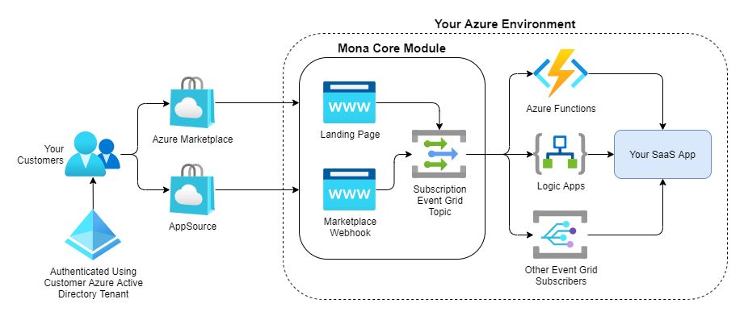

# Mona for SaaS

> [**Version 2.0**](https://github.com/microsoft/mona-saas/discussions/134)

[The Azure Marketplace is an event-driven system.](https://learn.microsoft.com/partner-center/marketplace-offers/partner-center-portal/pc-saas-fulfillment-life-cycle) Customers purchase subscriptions to your SaaS app. They can change their subscriptions or purchase more seats. Some customers might cancel their subscriptions. These crucial events are the pulse of your SaaS app. Mona embraces this event-driven design by publishing all Marketplace-related events to [a custom Event Grid topic](https://learn.microsoft.com/azure/event-grid/custom-topics) deployed in your environment. [From there, you can handle the events however you want.](https://learn.microsoft.com/azure/event-grid/event-handlers) By default, Mona deploys a set of [Logic Apps](https://learn.microsoft.com/azure/logic-apps/logic-apps-overview) that enable you to control how your SaaS app responds to Marketplace events in a simple low/no-code environment.



## Quickstart

### Clone this repo

[Open an Azure Cloud Shell, choose the Bash experience](https://learn.microsoft.com/azure/cloud-shell/get-started/ephemeral?tabs=azurecli#start-cloud-shell), and clone this repo. Navigate to the setup folder.

```sh
git clone https://github.com/microsoft/mona-saas
cd mona-saas/Mona.SaaS/Mona.SaaS.Setup
```

### Run the setup script

Run the `basic-deploy.sh` script to deploy Mona into your Azure environment. You'll need to provide only two parameters:

| Name | `-` | Description |
| --- | --- | --- |
| **Region** | `r` | [The Azure region](https://azure.microsoft.com/explore/global-infrastructure/geographies/) where Mona should be deployed. For a complete list of Azure regions to choose from, run `az account list-locations -o table` from the Bash Cloud Shell. |
| **Name** | `n` | A unique name for your Mona deployment. It must be 5-13 alphanumeric characters. |

#### Example

```bash
./basic-deploy.sh -r "eastus" -n "monatest01"
```

Once the script is complete, you will be presented with a link to your Mona deployment's admin center. Click the link to finish setting up Mona. Be sure to bookmark the link so you can have quick and easy access to the Mona admin center later. 

> Both [guests and members](https://learn.microsoft.com/entra/external-id/user-properties) of your [Entra (formerly Azure Active Directory) tenant](https://techcommunity.microsoft.com/t5/startups-at-microsoft/demystifying-microsoft-entra-id-tenants-and-azure-subscriptions/ba-p/4155261) have access to the Mona admin center.

### Configure event integrations

Take a moment to familiarize yourself with the Mona admin center by clicking through the tabs. 

Click on the **This Mona deployment** tab. This tab includes a deep link into the Azure portal and [the resource group](https://learn.microsoft.com/azure/azure-resource-manager/management/manage-resource-groups-portal) in which Mona was deployed. Click the resource group link. Within this resource group you will find seven different [Logic Apps](https://learn.microsoft.com/azure/logic-apps/logic-apps-overview)—each preconfigured to handle a specific Marketplace event. These Logic Apps are already connected to Mona's custom event grid topic. Configure these logic apps as your business needs dictate.

#### Why Azure Logic Apps?

Azure Logic Apps simplifies the way that you connect legacy, modern, and cutting-edge systems across cloud, on premises, and hybrid environments. You can use low-code-no-code tools to develop highly scalable integration solutions that support your enterprise and business-to-business (B2B) scenarios. The Azure Logic Apps integration platform provides [more than 1,000 prebuilt connectors](https://learn.microsoft.com/connectors/connector-reference/connector-reference-logicapps-connectors) so that you can connect and integrate apps, data, services, and systems more easily and quickly.

> You don't have to use Azure Logic Apps. [Event Grid offers a wide range of built-in options for handling events.](https://learn.microsoft.com/azure/event-grid/event-handlers)

Of course, once you've configured your integrations, you'll want to test them...

### Test your event integrations

Mona makes it easy to test your Marketplace integrations before going live with your SaaS offer.

From the Mona admin center, click on the **Integration testing** tab. On this tab, you'll find two URLs:

* **Test landing page URL**: Allows you test the complete end-to-end subscription purchasing experience.
* **Test webhook URL**: Allows you to publish webhook notifications against test subscriptions previously created using the test landing page.

#### Using the test landing page

[The test landing page implements the same flow as the live landing page that the Azure Marketplace will redirect your subscribers to.](https://learn.microsoft.com/partner-center/marketplace-offers/azure-ad-saas#process-steps-for-purchase-management) Any guest or member of your Entra tenant can use the test landing page. By default, the test landing page endpoint creates a fake test subscription complete with a full set of fake properties.

You can fully customize the test subscription that is created allowing you to test various subscription scenarios using the query string parameters listed below.

* `subscriptionId`
* `subscriptionName`
* `offerId`
* `planId`
* `isFreeTrial`
* `seatQuantity`
* `term_startDate`
* `term_endDate`
* `term_termUnit`
* `beneficiary_aadObjectId`
* `beneficiary_aadTenantId`
* `beneficiary_userEmail`
* `beneficiary_userId`
* `purchaser_aadObjectId`
* `purchaser_aadTenantId`
* `purchaser_userEmail`
* `purchaser_userId`

For example, to customize the subscription name and offer ID, add query string parameters like this:

```url
https://mona-admin-yourdeployment.azurewebsites.net/test?subscriptionName=MySubscription&offerId=OfferA
```

Properties not configured via query string parameters will automatically be assigned fake values.

See [the Azure Marketplace docs](https://learn.microsoft.com/partner-center/marketplace-offers/partner-center-portal/pc-saas-fulfillment-subscription-api) for more information about these subscription properties.

#### Using the test webhook

Once you've created a test subscription, you can try issuing webhook notifications against it. While you don't have to authenticate against the test webhook endpoint, it will only work for subscriptions previously created via the test landing page. Use your favorite API client (e.g., [Postman](https://www.postman.com/downloads/), [cURL](https://curl.se/docs/tutorial.html)) to POST JSON webhook notifications to the test webhook endpoint. These test webhook notifications don't actually change the state of the test subscription; they are for integration testing purposes only.

Refer to the table below for more information on issuing webhook notifications.

<table>
<tr>
<td><p><b>Plan change</b></p><p>Occurs when a customer chooses a different plan for their subscription.</p></td>
<td>

```json
{
  "action": "ChangePlan", 
  "subscriptionId": "11111111-1111-1111-1111-111111111111",
  "planId": "Casey's Plan"
} 
```
      
</td>
</tr>
<tr>
<td><p><b>Seat quantity change</b></p><p>Occurs when the customer changes the number of purchased licenses (seats) for a subscription.</p></td>
<td>

```json
{
  "action": "ChangeQuantity", 
  "subscriptionId": "11111111-1111-1111-1111-111111111111",
  "quantity": 15
} 
```
      
</td>
</tr>
<tr>
<td><p></op><b>Suspension</b></p><p>Occurs when a customer's subscription payment instrument has become invalid and payment is not received on time.</p></td>
<td>

```json
{
  "action": "Suspend", 
  "subscriptionId": "11111111-1111-1111-1111-111111111111"
} 
```
      
</td>
</tr>
<tr>
<td><p><b>Cancellation</b></p><p>Occurs when a customer cancels their subscription.</p></td>
<td>

```json
{
  "action": "Unsubscribe", 
  "subscriptionId": "11111111-1111-1111-1111-111111111111"
} 
```
      
</td>
</tr>
<tr>
<td><p><b>Reinstatement</b></p><p>Occurs after a suspended subscription is reinstated. This notification indicates that the customer's payment instrument has become valid again, a payment has been made for the subscription, and the subscription is being reinstated.</p></td>
<td>

```json
{
  "action": "Reinstate", 
  "subscriptionId": "11111111-1111-1111-1111-111111111111"
} 
```
      
</td>
</tr>
<tr>
<td><p><b>Renewal</b></p><p>Occurs when a subscription is automatically renewed at the end of the subscription term of a month or a year.</p></td>
<td>

```json
{
  "action": "Renew", 
  "subscriptionId": "11111111-1111-1111-1111-111111111111"
} 
```
      
</td>
</tr>
</table>

### Notify the Marketplace when a subscription has been activated

> 💬 We are actively soliciting feedback to make this experience better. [Please see this discussion for more information.](https://github.com/microsoft/mona-saas/discussions/140)

After a customer purchases a subscription, you have 48 hours to activate it and notify the Marketplace. Billing starts when the subscription is activated.

Calls to the Marketplace API must be authenticated using Mona’s external managed identity.

To locate the managed identity:

- Go to the Mona admin center.
- Open the **This Mona deployment** tab.
- Click **Managed external identity**.

This will direct you to the Azure portal, where you can manage the identity. You can use this identity in [Logic Apps](https://learn.microsoft.com/azure/logic-apps/authenticate-with-managed-identity?tabs=consumption#authenticate-access-with-managed-identity), [Azure Functions](https://learn.microsoft.com/azure/azure-functions/functions-identity-based-connections-tutorial), or [other managed identity options](https://learn.microsoft.com/entra/identity/managed-identities-azure-resources/managed-identities-status). Use the managed identity to [obtain a token for the Marketplace API](https://learn.microsoft.com/partner-center/marketplace-offers/partner-center-portal/pc-saas-registration#how-to-get-the-publishers-authorization-token) and [activate the subscription](https://learn.microsoft.com/partner-center/marketplace-offers/partner-center-portal/pc-saas-fulfillment-subscription-api#activate-a-subscription). 

> When requesting a token to call the Marketplace API, be sure to set `scope` to `20e940b3-4c77-4b0b-9a53-9e16a1b010a7`.
              
### Set up your SaaS offer in Partner Center

Refer to [these docs](https://learn.microsoft.com/en-us/partner-center/marketplace-offers/plan-saas-offer) for more information on setting up your SaaS offer via the Partner Center.

During your SaaS offer setup, [you'll be prompted to provide some "technical details"](https://learn.microsoft.com/partner-center/marketplace-offers/create-new-saas-offer-technical) that are used to connect your SaaS offer to your Mona deployment. The Azure Marketplace uses these details to redirect new purchases to the Mona landing page and issue webhook notifications to the Mona webhook endpoint.

To find these settings:

- Go to the Mona admin center.
- Open the **Marketplace offer technical details** tab.

Copy and paste these settings into the Partner Center when setting up your SaaS offer.

## Who supports Mona for SaaS?

Please see [our support docs](SUPPORT.md) for more information.

## Security

Please see [our security docs](SECURITY.md) for more information.

## How can I contribute?

Please refer to these docs for more information.

* [__Start Here__: Contibuting Guide](./CONTRIBUTING.md)
* [Microsoft Open Source Code of Conduct](./CODE_OF_CONDUCT.md)
* [Security](./SECURITY.md)

## Trademarks

This project may contain trademarks or logos for projects, products, or services. Authorized use of Microsoft trademarks or logos is subject to and must follow [Microsoft's Trademark & Brand Guidelines](https://www.microsoft.com/en-us/legal/intellectualproperty/trademarks/usage/general). Use of Microsoft trademarks or logos in modified versions of this project must not cause confusion or imply Microsoft sponsorship. Any use of third-party trademarks or logos are subject to those third-party's policies.
