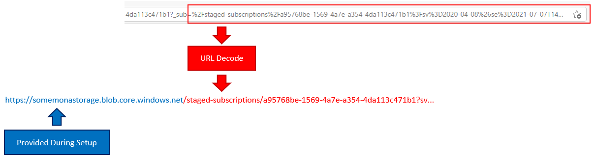

# Frequently asked questions

* [How do I install Mona?](#how-do-i-install-mona)
* [How do I uninstall Mona?](#how-do-i-uninstall-mona)
* [Where is the admin center?](#where-is-the-admin-center)
* [How can I return to the setup wizard?](#how-can-i-return-to-the-setup-wizard)
* [Where can I find my offer's Partner Center technical configuration details?](#where-can-i-find-my-offers-partner-center-technical-configuration-details)
* [Where can I learn more about the various events that Mona publishes?](#where-can-i-learn-more-about-the-various-events-that-mona-publishes)
* [Can I handle subscription events somewhere other than Logic Apps?](#can-i-handle-subscription-events-somewhere-other-than-logic-apps)
* [Who can access the admin center, setup wizard, and test endpoints?](#who-can-access-the-admin-center-setup-wizard-and-test-endpoints)
* [How do I manage Mona administrators?](#how-do-i-manage-mona-administrators)
* [What is the subscription purchase confirmation page?](#what-is-the-subscription-purchase-confirmation-page)
* [Can I retrieve subscription details from the purchase confirmation page?](#can-i-retrieve-subscription-details-from-the-purchase-confirmation-page)
* [What is the subscription configuration page?](#what-is-the-subscription-configuration-page)
* [How can I test my Marketplace integration logic before going live with an offer?](#what-is-the-subscription-configuration-page)
* [How do I debug Mona?](#how-do-i-debug-mona)

## How do I install Mona?

See [this doc](../README.md/#how-do-i-get-started-with-mona-saas).

## How do I uninstall Mona?

> ⚠️ __Warning!__ These actions are irreversible.

* [Delete Mona's Azure Active Directory (AAD) app registration.](https://docs.microsoft.com/azure/active-directory/develop/howto-remove-app#remove-an-application-authored-by-you-or-your-organization) Client ID can be found on Mona resource group tag `AAD App ID`.
* [Delete Mona's resource group.](https://docs.microsoft.com/azure/azure-resource-manager/management/delete-resource-group?tabs=azure-portal#delete-resource-group)

## Where is the admin center?

In your browser, navigate to `/admin` (e.g., `https://mona-web-***.azurewebsites.net/admin`).

## How can I return to the setup wizard?

In your browser, navigate to `/setup` (e.g., `https://mona-web-***.azurewebsites.net/setup`).

## Where can I find my offer's Partner Center technical configuration details?

When you create a SaaS offer through the Partner Center, you have to tell the Partner Center how to connect to you SaaS app to enable transactability with the Microsoft commercial marketplace. This is accomplished through your [offer's technical configuration details](https://docs.microsoft.com/en-us/azure/marketplace/create-new-saas-offer-technical).

These values can always be found in the Mona admin center (`/admin`).

## Where can I learn more about the various events that Mona publishes?

See [this doc](event-models/README.md).

## Can I handle subscription events somewhere other than Logic Apps?

Absolutely. As a convenience, we deploy "stub" Logic Apps into your Azure environment allowing you to rapidly build out subscription lifecycle workflows using a simple visual designer. These workflows are triggered by [events that Mona publishes to a custom event grid topic](event-models/README.md). There are many ways to subscribe to a custom event grid topic including [Azure Functions](https://docs.microsoft.com/azure/azure-functions/functions-bindings-event-grid-trigger) and [Power Automate](https://flow.microsoft.com/connectors/shared_azureeventgrid/azure-event-grid/) allowing you to select the integration option that makes the most sense for you and your organization.

> Can't find Mona's event grid topic? Navigate to the __Mona admin center__ (`/admin`), open the __subscription event handlers__ tab, and locate the event grid topic link. Opening this link will navigate you to the custom event grid topic in the Azure portal.

## Who can access the admin center, setup wizard, and test endpoints?

Only Mona Administrators can access the admin center, setup wizard, and test endpoints. 

## How do I manage Mona administrators?

1. Navigate to the admin center (`/admin`).
2. Open the __Mona SaaS configuration settings__ tab.
3. Click __Manage users__. 

You will be redirected to [Mona's Azure Active Directory (AAD) Mona Administrators app role where you can add/remove users](https://docs.microsoft.com/azure/active-directory/develop/howto-add-app-roles-in-azure-ad-apps).

## What is the subscription purchase confirmation page?

Mona acts as a proxy between the Microsoft commercial marketplace and your SaaS app by implenting the required landing page and webhook endpoints. When your customer confirms that they wish to purchase a subscription by clicking the __Confirm purchase__ button on the landing page, Mona redirects them to the _purchase confirmation page_. Essentially, this is where Mona hands new Microsoft commercial marketplace subscription purchases off to your app.

Mona administrators can configure the purchase confirmation page URL at any time by navigating to the setup wizard (`/setup`).

* Mona will automatically replace the URL token `{subscription-id}` with the applicable subscription ID on redirect.
* Mona provides time-limited, bearer URL access to full subscription details through the `_sub` query string parameter on redirect. [For more information on how this works, see this question.](#can-i-retrieve-subscription-details-from-the-purchase-confirmation-page)

## Can I retrieve subscription details from the purchase confirmation page?

After a customer has confirmed their AppSource/Marketplace purchase through the Mona landing page, they are automatically redirected to a [publisher-managed (ISV) purchase confirmation page](#what-is-the-subscription-purchase-confirmation-page) to complete their subscription configuration.

By default, Mona will also include a partial link (via the `_sub` query parameter highilghted in the below image) that, when combined with the base storage URL (provided during Mona setup), can be used to efficiently and securely pull the subscription details. Note that the `_sub` parameter is URL encoded. In order to use it, you must first URL decode it before combining it with the base storage URL.

> By default, subscription definitions are staged in Azure blob storage. The URL that you construct is actually a [shared access signature (SAS) token](https://docs.microsoft.comazure/storage/common/storage-sas-overview#sas-token) granting time-limited, read-only access to the subscription definition blob.

When you issue an HTTP GET request against the combined URL, the full subscription details will be returned as a JSON object. The URL itself is valid only for a short period of time (by default, five (5) minutes). After that time, the URL is useless.

This design prevents outside actors from either spoofing the subscription details or reading the subscription details since you need both pieces of information (the base storage URL and the `_sub` parameter value) in order to access the information.

> This functionality is enabled by default. You can disable it by setting the `Deployment:SendSubscriptionDetailsToPurchaseConfirmationPage` configuration value to `false` and restarting the web app.

## What is the subscription configuration page?

Microsoft provides a link (through the various commercial marketplace web interfaces) to your subscribers allowing them to manage their subscription. In practice, this link redirects the user to your landing page (the same one Mona exposes to support new subscription purchases) with a token that resolves to an existing subscription. As the SaaS provider, it's your responsibility to check for this condition and, if needed, redirect the customer to a subscription management experience. To simplify things, Mona always checks for this condition and, if the subscription already exists, automatically redirects the user to the configured _subscription configuration page_.

* Mona will automatically replace the URL token `{subscription-id}` with the applicable subscription ID on redirect.

## How can I test my Marketplace integration logic before going live with an offer?

By default, Mona exposes a set of test landing page and webhook endpoints that Mona administrators can use to test integration logic without the need for an actual Microsoft commercial marketplace offer.

> These endpoints can be disabled by [setting the `Deployment:IsTestModeEnabled` configuration setting to `false`](config-settings.md).

You can find both test endpoints in the __Testing__ tab of the Mona admin center (`/admin`).

The test landing page (`/test`) can only be accessed by Mona administrators. The test landing page behaves and looks just like the live landing page except for a warning banner across the top of the page indicating that you're running in test mode. You can customize the test subscription that Mona automatically generates of the test subscription by using [these query string parameters](https://github.com/microsoft/mona-saas/blob/357aa09039f9c8c0dfd324cdd7903b3dbdef88c6/Mona.SaaS/Mona.SaaS.Web/Controllers/SubscriptionController.cs#L591).

You can use tools like cURL or Postman and the Mona test webhook endpoint (`/webhook/test`) to test [all Marketplace webhook invocations](https://docs.microsoft.com/azure/marketplace/partner-center-portal/pc-saas-fulfillment-api-v2#implementing-a-webhook-on-the-saas-service) against subscriptions previously created through the test landing page (`/test`). These test subscriptions automatically expire (you can no longer perform webhook operations against them) after 30 days of inactivity. Like the live webhook, the test webhook requires no authentication but operations succeed only when executed against existing test subscriptions.

## How do I debug Mona?

Most issues are easy to diagnose using the [Application Insights](https://docs.microsoft.com/azure/azure-monitor/app/app-insights-overview) resource automatically deployed into your Mona resource group on setup.

Given the numerous dependencies that Mona takes on Azure, the easiest way to debug it is to you deploy it into your Azure environment (using the provided setup script) and [use Visual Studio to remotely debug the Mona web app](https://docs.microsoft.com/azure/app-service/troubleshoot-dotnet-visual-studio#remotedebug) directly. This will require you opening the Mona solution that you previously cloned in Visual Studio and use Visual Studio's Cloud Explorer to attach the debugger.

Remotely debugging the Mona web app using the method described above requires that the app be deployed in [`debug` configuration](https://docs.microsoft.com/visualstudio/debugger/how-to-set-debug-and-release-configurations). By default, the Mona web app is deployed in __release__ configuration for performance reasons. When debugging, we recommend that you [use Visual Studio to publish the Mona web app in __debug__ configuration](https://docs.microsoft.com/azure/app-service/quickstart-dotnetcore?tabs=netcore31&pivots=development-environment-vs#publish-your-web-app) to its own [App Service deployment slot](https://docs.microsoft.com/azure/app-service/deploy-staging-slots). Doing so will prevent your production customers from being interrupted and give you a clean, easily disposed environment for your debugging needs.
