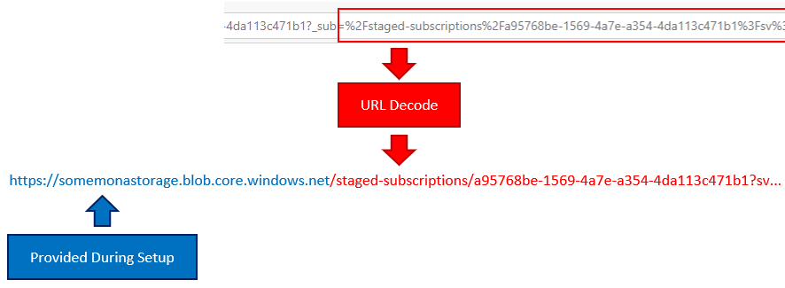

# Frequently asked questions

* [How do I install Mona?](#how-do-i-install-mona)
* [How do I uninstall Mona?](#how-do-i-uninstall-mona)

## How do I install Mona?

See [this doc](../README.md/#how-do-i-get-started-with-mona-saas).

## How do I uninstall Mona?

> ⚠️ __Warning!__ These actions are irreversible.

* [Delete Mona's Azure Active Directory (AAD) app registration.](https://docs.microsoft.com/azure/active-directory/develop/howto-remove-app#remove-an-application-authored-by-you-or-your-organization) Client ID can be found on Mona resource group tag `AAD App ID`.
* [Delete Mona's resource group.](https://docs.microsoft.com/azure/azure-resource-manager/management/delete-resource-group?tabs=azure-portal#delete-resource-group)

## Where is the admin center?

In your browser, navigate to `/admin` (e.g., `https://mona-web-***/admin`).

### How do I manage Mona administrators?

See [this section.](#user-management)

### How do I manage Mona configuration settings?

1.  Navigate to the Mona admin center (`/admin`).
2.  Open the __Mona SaaS configuration settings__ tab.
3.  Click __Manage configuration settings__. This will redirect you to the Azure portal where you can [manage configuration settings for the Mona web app](https://docs.microsoft.com/azure/app-service/configure-common#configure-app-settings).

[Refer to this doc](./config-settings.md) for more information on each configuration setting.

> Note that updating any of these settings will cause the Mona web app to restart.

### How do I modify my publisher configuration after setup?

When you first install Mona, you're directed to a setup wizard where you provide some basic information about your business and SaaS app. Should you ever need to change these values, simply return to the setup screen (`/setup`).

### Where can I find the Mona admin center?

Navigate to `/admin` (e.g., `https://mona-web-*.azurewebsites.net/admin`).

### Where can I find my Mona test endpoints?

1. Navigate to the Mona admin center (`/admin`).
2. Open the __Testing_ tab. Note both the landing page and webhook URLs.

### Where can I find my Partner Center technical configuration details?

When you create a new SaaS offer within Partner Center you will be prompted to provide some [technical configuration information about your SaaS app](https://docs.microsoft.com/azure/marketplace/create-new-saas-offer-technical). You can _always_ find this information within the __Partner center technical details__ tab of the Mona admin center (`/admin`).

## Subscription workflow

### How do I edit my subscription lifecycle workflows?

1. Navigate to the Mona admin center (`/admin`).
2. Open the __Subscription event handlers__ tab.
3. Locate the workflow that you wish to edit and click __Edit workflow__.

### Can I retrieve subscription details from the purchase confirmation page?

After a customer has confirmed their AppSource/Marketplace purchase through the Mona landing page, they are automatically redirected to a publisher-managed (ISV) purchase confirmation page to complete their subscription configuration.

By default, Mona will also include a partial link (via the `_sub` query parameter highilghted in the below image) that, when combined with the base storage URL (provided during Mona setup), can be used to efficiently and securely pull the subscription details. Note that the `_sub` parameter is URL encoded. In order to use it, you must first URL decode it before combining it with the base storage URL.

> By default, subscription definitions are staged in Azure blob storage. The URL that you construct is actually a [shared access signature (SAS) token](https://docs.microsoft.comazure/storage/common/storage-sas-overview#sas-token) granting time-limited, read-only access to the subscription definition blob.

When you issue an HTTP GET request against the combined URL, the full subscription details will be returned as a JSON object. The URL itself is valid only for a short period of time (by default, five (5) minutes). After that time, the URL is useless.

This design prevents outside actors from either spoofing the subscription details or reading the subscription details since you need both pieces of information (the base storage URL and the `_sub` parameter value) in order to access the information.

> This functionality is enabled by default. You can disable it by setting the `Deployment:SendSubscriptionDetailsToPurchaseConfirmationPage` configuration value to `false` and restarting the web app.

## User management

### Who can access the Mona admin center?

Only users that belong to your Mona deployment's Azure Active Directory tenant and Mona Administrators application role can access the Mona admin center. For more information on managing Mona administrators, see [this question](#how-do-i-manage-mona-administrators).

### Who can access the Mona setup wizard?

Only users that belong to your Mona deployment's Azure Active Directory tenant and Mona Administrators application role can access the Mona setup wizard. For more information on managing Mona administrators, see [this question](#how-do-i-manage-mona-administrators).

### Who can access the Mona test endoints?

Only users that belong to your Mona deployment's Azure Active Directory tenant and Mona Administrators application role can access the Mona landing page and webhook test endpoints. For more information on managing Mona administrators, see [this question](#how-do-i-manage-mona-administrators).

### How do I manage Mona administrators?

1. Navigate to your Mona admin center (`/admin`).
2. Open the __Mona SaaS configuration settings__ tab.
3. Click __Manage users__. This will redirect you to the Azure portal where you can add/remove users from the Mona Administrators application role.

