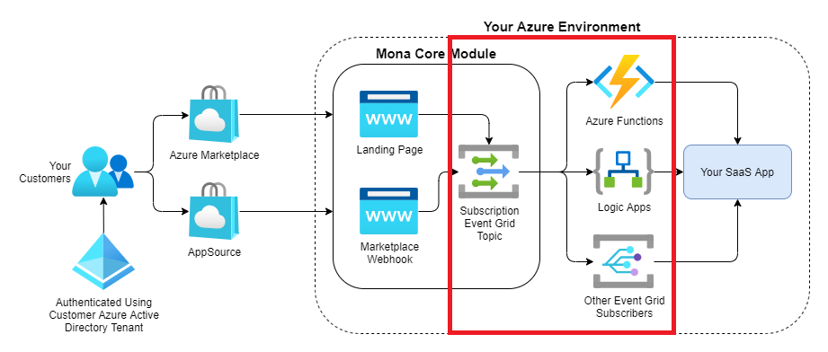

# Event models

By default, Mona publishes all subscription-related events to a custom Event Grid topic as highlighted in the diagram below.

## Event model versions

### [Version `2021-10-01`](2021-10-01.md) (Current)

* Flattened event models for simplified downstream consumption
* Switched to pascal-cased, human-readable names

### [Version `2021-05-01`](2021-05-01.md)

* Initial version
